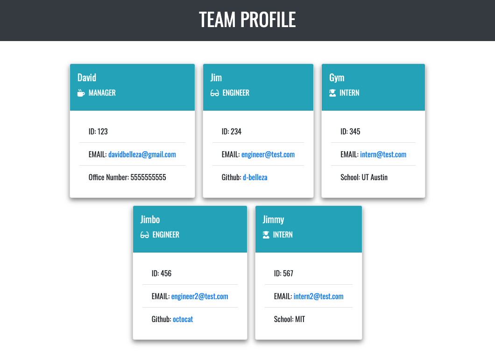

# team-profile-generator

## Description
An application that uses the command-line to generate a Team profile HTML page using user input.

## Table of Contents
* [Installation](#installation)
* [Usage](#usage)
* [Contributing](#contributing)
* [Testing](#testing)
* [Questions](#questions)
    
## Installation
Run npm install to install the required packages

## Usage
In the command line, run node index and answer all of the prompts given in the terminal. An index.html and style.css file will then be created in the dist directory that the user can use.

Example of generated page:

## Contributing
To contribute, please contact the repository owner.

## Testing
Run npm test to view the Jest tests

## Questions
Visit my Github
[d-belleza](https://github.com/d-belleza)

Additional questions, please send an email at
[davidbelleza@gmail.com](mailto:davidbelleza@gmail.com)